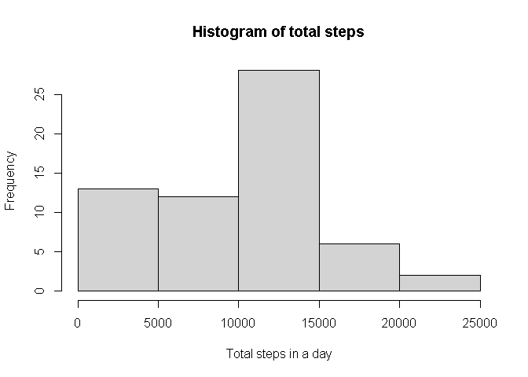
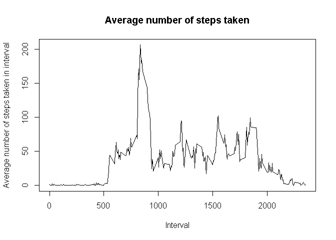
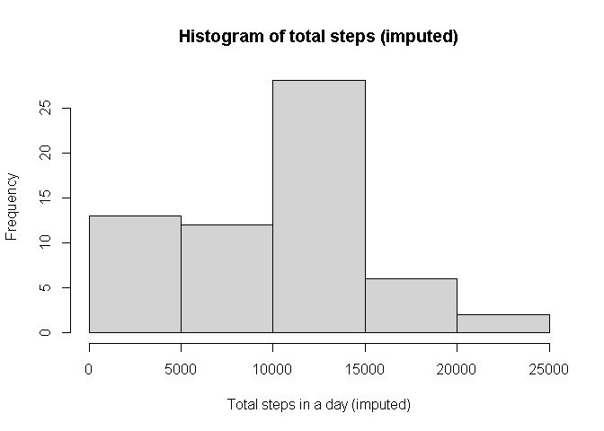
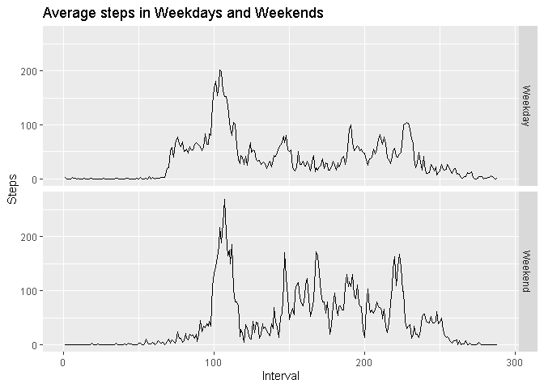

## Loading and preprocessing the data


```r
download.file('https://d396qusza40orc.cloudfront.net/repdata%2Fdata%2Factivity.zip','activity.zip')
unzip('activity.zip')
activity <- read.csv('activity.csv')
activity$date <- as.Date(activity$date,'%Y-%m-%d')
```


## What is mean total number of steps taken per day?


```r
tmp_data <- tapply(activity$steps, INDEX = activity$date, sum, na.rm=TRUE)
hist(tmp_data, main='Histogram of total steps', xlab = 'Total steps in a day')
```

<!-- -->

```r
men <-mean(tmp_data)
med <- median(tmp_data)
```

So the mean steps is 9354.2295082 and the median steps is 10395.

## What is the average daily activity pattern?


```r
tmp_data <- tapply(activity$steps, INDEX = activity$interval, mean, na.rm=TRUE)
plot(as.numeric(row.names(tmp_data)), tmp_data, type = 'l', main= 'Average number of steps taken',
     xlab = 'Interval', ylab = 'Average number of steps taken in interval')
```

<!-- -->

```r
max_int <- row.names(tmp_data)[which.max(tmp_data) ]
```

Maximum number of steps taken in the interval 835.

## Imputing missing values


```r
tmp_data <- tapply(activity$steps, INDEX = activity$interval, mean, na.rm=TRUE)

num_na <- sum(is.na(activity$steps))
activity2 <- activity
indices <- which(is.na(activity2$steps))
interval <- activity2$interval[indices]

activity2$steps[indices] <- sapply(interval, function(int_var) 
  tmp_data[which(as.numeric(row.names(tmp_data)) == int_var)])


tmp_data2 <- tapply(activity$steps, INDEX = activity$date, sum, na.rm=TRUE)
hist(tmp_data2, main='Histogram of total steps (imputed)', xlab = 'Total steps in a day (imputed)')
```

<!-- -->

```r
men2 <- mean(tmp_data2)
med2 <- median(tmp_data2)
```

The number of missing values is 2304.
The mean steps is 9354.2295082 and the median steps is 10395.
The effect of imputing the missing values on the histogram appears to be negligible.
There also seems to be no effect on the mean and median also.

## Are there differences in activity patterns between weekdays and weekends?


```r
activity3 <- activity
activity3$weekday <- weekdays(activity3$date)
activity3$weekday <- sub('Friday|Saturday',replacement = 'Weekend',x = activity3$weekday)
activity3$weekday[activity3$weekday != 'Weekend'] <- 'Weekday'

df <- as.data.frame(tapply(activity3$steps, list(activity3$interval, 
                                                 activity3$weekday), mean, na.rm=TRUE))
df$interval <- row.names(df)
tmp<- reshape(df, varying = c('Weekday', 'Weekend'), v.names='Steps', direction = 'long', idvar = 'Interval',times = c('Weekday', 'Weekend'))

library(ggplot2)
ggplot(tmp,aes(Interval, Steps) )+geom_line()+facet_grid(time~.) +ggtitle('Average steps in Weekdays and Weekends')
```

<!-- -->


I used Fridays and Saturdays as the Weekends, because they are the weekends where I live.

And it appears that the weekends involve more steps on average than weekdays.
